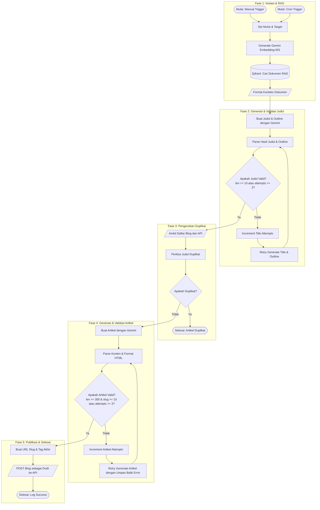

# Blog Content Engine v3.3.1

**Blog Content Engine** adalah sistem otomatisasi pembuatan konten artikel blog B2B berbasis SEO yang mengintegrasikan **n8n**, **Qdrant Vector Database (RAG)**, dan **Google Gemini AI**. Proyek ini dirancang untuk menghasilkan artikel berkualitas tinggi yang akurat, terstruktur secara profesional, dan bebas dari halusinasi kecerdasan buatan karena merujuk langsung pada dokumen pengetahuan bisnis riil.

---

## Komponen & Arsitektur Utama

Sistem ini didukung oleh tiga pilar teknologi utama:

1.  **n8n (Workflow Automation)**: Mengatur seluruh orkestrasi alur kerja, mulai dari penjadwalan (*cron*), pemanggilan API, pemrosesan data dengan JavaScript, hingga mekanisme *retry-recovery* otomatis.
2.  **Qdrant Vector Database**: Bertindak sebagai basis pengetahuan (*knowledge base*) tempat dokumen-dokumen produk ERP disimpan dalam bentuk vektor untuk mendukung fungsionalitas **Retrieval-Augmented Generation (RAG)**.
3.  **Google Gemini (Gemini 2.5 Flash & Gemini Embedding)**: Digunakan untuk menghasilkan representasi vektor dokumen (*embedding*) dan melakukan generasi kreatif berupa judul, outline, serta artikel blog dengan format HTML bersih.

---

## Bagan Alur Kerja (Workflow Diagram)

Alur otomatisasi dalam workspace ini dirancang dengan tingkat keandalan yang tinggi menggunakan gerbang validasi ganda untuk judul dan artikel:



---

## Fitur-Fitur Unggulan

*   **Pencarian Berbasis RAG**: Mengambil konteks faktual dari Qdrant menggunakan model `gemini-embedding-001` untuk memastikan tulisan mengacu pada modul dan studi kasus riil.
*   **Gerbang Validasi Judul**: Judul dijamin memiliki tingkat keterbacaan SEO yang baik (minimal 10 karakter) dengan sistem *retry* hingga 3 kali.
*   **Anti-Duplikasi Konten**: Secara cerdas melakukan *fetch* artikel yang sudah ada di portal tujuan (`domain-anda.com/api/blogs`) untuk mencegah pembuatan artikel dengan judul yang sama.
*   **Kualitas & Kepatuhan Format HTML**: Melakukan pengecekan ketat terhadap panjang artikel (minimal 300 karakter untuk draft aman) dan kepatuhan tag HTML (hanya mengizinkan tag semantik seperti `<h2>`, `<h3>`, `<p>`, `<ul>`, `<li>`, `<strong>`, dan `<em>` tanpa *markdown* mentah).
*   **Self-Healing AI Loop**: Jika hasil generasi artikel pertama gagal melewati validasi, n8n akan mengirimkan kembali artikel gagal beserta log kegagalannya ke Gemini untuk dilakukan perbaikan terarah (*auto-recovery loop*).
*   **Generasi Slug & Tag Otomatis**: Secara otomatis memformat slug yang aman untuk URL dan menghasilkan 5-8 tag SEO yang relevan.
*   **Integrasi REST API**: Mengunggah artikel secara otomatis sebagai status *Draft* untuk ditinjau oleh editor manusia sebelum dipublikasikan.

---

## Cara Memulai & Instalasi

### 1. Prasyarat Lingkungan
Pastikan Anda memiliki file kredensial dan API Key berikut:
*   **Google Gemini API Key** (untuk integrasi AI)
*   **API Credentials** (Header authentication untuk posting blog)

### 2. Menjalankan Infrastruktur (Docker)
Workspace ini telah dilengkapi dengan berkas `docker-compose.yml` untuk menjalankan instansi lokal n8n dan Qdrant secara instan.

Jalankan perintah berikut pada terminal di direktori workspace ini:
```bash
docker compose up -d
```

Layanan yang akan berjalan:
*   **n8n**: Tersedia pada port `5678` (Data disimpan secara lokal di `./n8n_data`).
*   **Qdrant**: Tersedia pada port `6333` (Dashboard visual) & `6334` (GRPC) (Data disimpan secara persisten).

### 3. Mengimpor Alur Kerja ke n8n
1.  Buka browser Anda dan masuk ke dashboard n8n: `http://localhost:5678`
2.  Buat alur kerja baru (*Create new workflow*).
3.  Klik ikon menu tiga titik di pojok kanan atas, lalu pilih **Import from file...**.
4.  Pilih berkas [core.json](core.json) dari komputer Anda.
5.  Konfigurasikan Kredensial berikut pada n8n Anda:
    *   **googlePalmApi**: Masukkan Google Gemini API Key Anda.
    *   **httpHeaderAuth (Account 1)**: Konfigurasi otorisasi header untuk API.
    *   **httpHeaderAuth (Account 2)**: Konfigurasi header tambahan jika diperlukan.

---

## Konfigurasi Alur Kerja (Workflow Customization)

Anda dapat dengan mudah menyesuaikan target penulisan artikel dengan memodifikasi parameter pada node **Set Niche**:

*   `industry`: Industri target pembaca (contoh: `UMKM`, `Retail`, `Manufaktur`).
*   `problem`: Masalah operasional yang dihadapi industri tersebut (contoh: `pencatatan manual`, `stok bocor`).
*   `solution`: Solusi spesifik yang ditawarkan oleh produk ERP Anda (contoh: `ERP sederhana`, `Manajemen Inventaris Otomatis`).
*   `userId`: ID pengguna pembuat artikel pada platform blog.

---

## Penyesuaian Formulir & Skema API (API & Form Customization)

Karena setiap platform blog, CMS (seperti WordPress, Ghost, Strapi), atau pemicu formulir input memiliki struktur database dan skema data yang berbeda, Anda perlu melakukan beberapa penyesuaian pada node-node berikut agar alur kerja dapat terintegrasi dengan mulus pada sistem Anda.

### 1. Menyesuaikan Input Pemicu (Form Input)
Alur kerja bawaan menggunakan node **Set Niche** (berisi nilai statis) untuk kebutuhan pengujian. Jika Anda ingin menghubungkannya dengan formulir dinamis:
*   **n8n Form Trigger / Webhook**: Hapus node `Set Niche` dan ganti dengan node **n8n Form Trigger** atau **Webhook** di awal alur kerja.
*   **Pemetaan Variabel**: Pastikan field masukan dari formulir Anda dipetakan ulang di node **Get Embedding (RAG)** menggunakan ekspresi n8n yang dinamis.
    *   Contoh pemetaan jika input berasal dari formulir n8n:
        *   `{{ $json.body.industry }}`
        *   `{{ $json.body.problem }}`
        *   `{{ $json.body.solution }}`

### 2. Menyesuaikan Pemeriksaan Duplikat (GET Blogs)
Node **GET Blogs** memanggil API untuk mengambil daftar artikel guna mencegah pembuatan artikel dengan judul yang sama.
*   **Ubah Endpoint**: Sesuaikan URL pada node `GET Blogs` ke endpoint API daftar artikel blog Anda.
*   **Penyesuaian Struktur Kode (Check Duplicate)**: Jika API Anda mengembalikan struktur data yang berbeda (misalnya bukan berformat array di dalam objek `.data`), sesuaikan kode JavaScript di dalam node **Check Duplicate**:
    ```javascript
    // Contoh default jika API mengembalikan { data: [ { title: "..." } ] }
    const blogs = $json.data || []; 
    
    // GANTI baris di atas jika API Anda mengembalikan array langsung secara mentah:
    // const blogs = $json || [];
    
    // ATAU jika properti judul di CMS Anda bernama 'post_title' (contoh: WordPress):
    // const exists = blogs.some(b => b.post_title === title);
    ```

### 3. Menyesuaikan Payload Publikasi (POST Blog)
Node **POST Blog** mengirimkan payload artikel final. Sesuaikan payload parameter body di dalam node HTTP Request ini dengan skema API CMS tujuan Anda:
*   **WordPress REST API (Contoh)**:
    Jika menggunakan WordPress, payload body dikirimkan via JSON dengan parameter standar:
    ```json
    {
      "title": "{{ $json.title }}",
      "content": "{{ $json.content }}",
      "status": "draft",
      "slug": "{{ $json.slug }}"
    }
    ```
*   **Ghost CMS API (Contoh)**:
    Ghost menggunakan format editor khusus (Mobiledoc/Lexical) dan dibungkus di dalam array `posts`. Sesuaikan parameter pengiriman agar sesuai dengan dokumentasi API Ghost.
*   **Custom API / Headless CMS**:
    Sesuaikan daftar parameter pada node **POST Blog** (seperti `title`, `content`, `slug`, `tags`, `userId`) agar sesuai persis dengan nama field di database atau skema API backend Anda.

---

## Keamanan & Kepatuhan Data

*   **Penyimpanan Data**: Folder `n8n_data` diabaikan oleh Git melalui `.gitignore` untuk mencegah bocornya data sesi n8n, kredensial lokal, dan alur kerja aktif yang sedang berjalan.
*   **API Key**: Semua token autentikasi dikelola langsung di dalam kredensial internal n8n yang terenkripsi dan **tidak** ditulis secara mentah di dalam file `core.json` atau file konfigurasi docker.

---
Dikembangkan untuk otomatisasi yang andal dan cerdas oleh mikeu-dev.
