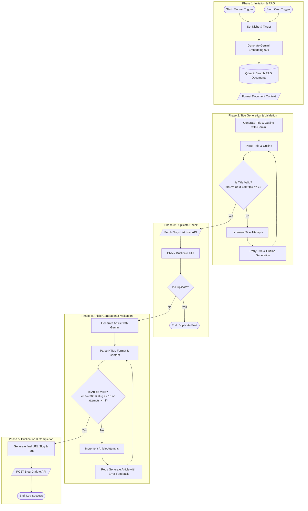

# Blog Content Engine v3.3.1

[Bahasa Indonesia](./README.id.md) 🇮🇩

**Blog Content Engine** is an SEO-optimized B2B blog article generation automation system that integrates **n8n**, **Qdrant Vector Database (RAG)**, and **Google Gemini AI**. This project is designed to produce high-quality, professionally-structured, and factual articles, completely free of AI hallucinations by referencing real company product documentation and knowledge bases.

---

## Core Components & Architecture

The system is powered by three main technological pillars:

1.  **n8n (Workflow Automation)**: Orchestrates the entire execution flow—from cron scheduling, API requests, Javascript-based data processing, to automated retry-recovery logic.
2.  **Qdrant Vector Database**: Acts as the corporate knowledge base storing ERP product documents as high-dimensional vectors to enable highly accurate **Retrieval-Augmented Generation (RAG)**.
3.  **Google Gemini (Gemini 2.5 Flash & Gemini Embedding)**: Used for document vector representation (*embedding*) and creative generation of SEO titles, structures, outlines, and HTML-compliant blog articles.

---

## Workflow Diagram

The automation flow inside this workspace is designed with high fault tolerance, utilizing a double-pass validation gateway for both titles and articles:



---

## Key Features

*   **RAG-Powered Search**: Fact-checks and fetches real corporate module data from Qdrant using the `gemini-embedding-001` model to ensure articles are accurate and authentic.
*   **Title Validation Gateway**: Ensures generated titles adhere to SEO readability standards (min 10 characters) with a robust retry threshold of up to 3 times.
*   **Duplicate Content Prevention**: Intelligently fetches existing posts from your portal API (`domain-anda.com/api/blogs`) and halts execution if the title already exists.
*   **Strict HTML Compliance**: Validates article length (min 300 characters for safe draft size) and filters raw Markdown, allowing only clean semantic HTML tags (`<h2>`, `<h3>`, `<p>`, `<ul>`, `<li>`, `<strong>`, and `<em>`).
*   **Self-Healing AI Loop**: If the initial article fails validation, n8n automatically feeds the validation logs and raw payload back into Gemini for structured correction.
*   **Automated Slug & Tag Generator**: Formats web-safe URL slugs and extracts 5–8 highly relevant SEO tags automatically.
*   **REST API Integration**: Seamlessly publishes completed posts directly into your CMS or portal database as a review-ready `Draft`.

---

## Getting Started & Installation

### 1. Environmental Prerequisites
Ensure you have configured the following credentials and API keys:
*   **Google Gemini API Key** (for AI-powered workflows)
*   **API Credentials** (Header authentication for your target blog REST API)

### 2. Spanning the Infrastructure (Docker)
This workspace is equipped with a `docker-compose.yml` to launch local n8n and Qdrant containers instantly.

Execute the following terminal command in this workspace directory:
```bash
docker compose up -d
```

Services exposed:
*   **n8n**: Available on port `5678` (Persistent session/credentials stored locally in `./n8n_data`).
*   **Qdrant**: Available on port `6333` (Web Dashboard) & `6334` (gRPC port).

### 3. Importing Workflow into n8n
1.  Open your browser and login to your n8n dashboard: `http://localhost:5678`
2.  Create a new empty workflow.
3.  Click the top-right three-dot menu and select **Import from file...**.
4.  Choose the [core.json](core.json) file from this repository directory.
5.  Configure the following credentials in your n8n credentials vault:
    *   **googlePalmApi**: Paste your Google Gemini API Key.
    *   **httpHeaderAuth (Account 1)**: Header authorization configuration for your blog API.
    *   **httpHeaderAuth (Account 2)**: Additional custom headers if required.

---

## Workflow Customization

You can effortlessly customize writing goals, topics, and styles by modifying variables on the **Set Niche** node:

*   `industry`: Target customer industry (e.g., `SME`, `Retail`, `Manufacturing`).
*   `problem`: Core operational struggles of that industry (e.g., `manual bookkeeping`, `inventory leakage`).
*   `solution`: Specific ERP module value offerings solving the problem (e.g., `Simple ERP`, `Automated Inventory Tracking`).
*   `userId`: The author user ID assigned to the published draft.

---

## API & Form Customization

Since every blogging platform, headless CMS (like WordPress, Ghost, Strapi), or custom forms possess different database schema representations, follow these guides to integrate n8n smoothly into your setup:

### 1. Adjusting Input Triggers (Forms & Dynamic Triggers)
By default, the workflow uses a static **Set Niche** node for sandbox testing. To hook it up with live form inputs:
*   **n8n Form / Webhooks**: Replace `Set Niche` with an **n8n Form Trigger** or **Webhook** node at the workflow root.
*   **Field Mapping**: Map dynamic incoming fields inside the **Get Embedding (RAG)** node using dynamic n8n expressions.
    *   Example mapping if trigger is an n8n Form:
        *   `{{ $json.body.industry }}`
        *   `{{ $json.body.problem }}`
        *   `{{ $json.body.solution }}`

### 2. Customizing Duplicate Check (GET Blogs)
The **GET Blogs** HTTP Request node queries your active server to list already published posts.
*   **Adjust Endpoint**: Update the Request URL to point to your actual CMS list endpoint.
*   **Modify Javascript Logic (Check Duplicate)**: If your backend JSON output is not wrapped under the standard `.data` array, adapt the Javascript code inside the **Check Duplicate** node:
    ```javascript
    // Default format expects { data: [ { title: "..." } ] }
    const blogs = $json.data || []; 
    
    // REPLACE above line if your API returns a raw JSON array:
    // const blogs = $json || [];
    
    // OR if WordPress is used (where post title resides under 'post_title'):
    // const exists = blogs.some(b => b.post_title === title);
    ```

### 3. Customizing Publish Payload (POST Blog)
The **POST Blog** HTTP Request node handles the final draft publishing payload. Adjust the parameters inside this node's body according to your CMS API schema:
*   **WordPress REST API Example**:
    Send JSON payload mapping standard fields:
    ```json
    {
      "title": "{{ $json.title }}",
      "content": "{{ $json.content }}",
      "status": "draft",
      "slug": "{{ $json.slug }}"
    }
    ```
*   **Ghost CMS API Example**:
    Ghost wraps the request in a nested `posts` array and supports Lexical/Mobiledoc editor JSON structures. Adjust standard payloads matching Ghost developers' guidelines.
*   **Custom / Headless CMS API**:
    Edit the JSON keys inside the body field (e.g. mapping `title`, `content`, `slug`, `tags`, `userId`) to match your custom backend property definitions.

---

## Security & Data Compliance

*   **Local Persistence**: The `n8n_data` folder is fully ignored by Git via `.gitignore` to prevent leaking local encryption keys, active sessions, and dynamic database credentials.
*   **API Security**: All API keys, passwords, and authorization tokens must reside in n8n's encrypted local credentials vault, **never** hardcoded into `core.json` or Docker environment files.

---
Developed for reliable and intelligent automation by mikeu-dev.
